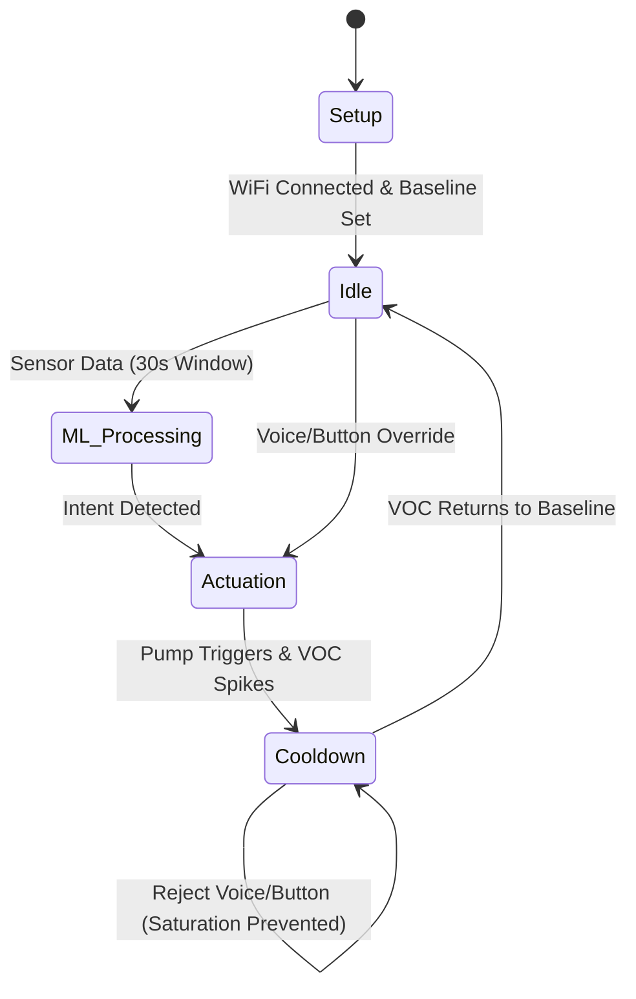

## Executive Summary

Week 1 was project foundation — concept locked, architecture defined, hardware ordered, devlog site live.

- **Concept & architecture** — Defined AuraSync as a context-aware scent diffuser built around a **Chemical Feedback Loop**: the BME680 VOC sensor measures post-spray air quality and feeds an on-device ML cooldown, preventing the over-saturation common in timed dispensers.
- **Hardware stack** — Finalised BOM: XIAO ESP32-S3, BME680, INMP441 I2S mic, ultrasonic atomizer, MT3608 boost + LiPo. Components ordered; in transit.
- **User flow** — End-to-end interaction model documented; functional architecture diagram drawn (below).
- **Devlog site** — This site scaffolded, styled, and deployed to GitHub Pages.

### Functional architecture

*AuraSync Functional Architecture Diagram.*

---

## 1. Hardware & BOM

We evaluated multiple component options, comparing trade-offs to select the most reliable configuration for both prototyping and our final demonstration.

* **Microcontroller:** We selected the **XIAO ESP32-S3** (dual-core, native I2S, vector instructions) over the ESP32-C3 to ensure enough compute headroom for Edge ML and audio processing.
* **Environmental Sensor:** The **BME680** was chosen because its VOC sensing is mandatory for our closed-loop feedback design (the BME280 was rejected for lacking this).
* **Audio Prototyping:** We adopted a dual strategy—using inexpensive **INMP441** modules for rapid prototyping, and the **Adafruit I2S MEMS Microphone** for the final reliable demo.
* **Actuation & Power:** We paired a **5V mini water pump** with an **Adafruit MOSFET driver** (featuring an integrated flyback diode) to safely switch inductive loads from the 3.3V logic board.

**Hardware Procurement Bill of Materials (BOM):**

| Component | Price | Qty | Vendor | Link |
| :--- | :--- | :--- | :--- | :--- |
| Seeed Studio XIAO ESP32-S3 | $7.49 | 2 | Seeed | [Product Link](https://www.seeedstudio.com/XIAO-ESP32S3-p-5627.html) |
| Adafruit BME680 | $18.95 | 1 | Adafruit | [Product Link](https://www.adafruit.com/product/3660) |
| Adafruit I2S MEMS Mic (SPH0645LM4H) | $13.72 | 1 | Amazon | [Product Link](https://a.co/d/067CTL8D) |
| INMP441 I2S Mic Module (3pcs) | $9.59 | 1 | Amazon | [Product Link](https://a.co/d/0g3abX0m) |
| 5V Micro Submersible Pump (4pcs) | $9.43 | 1 | Amazon | [Product Link](https://a.co/d/08kf9tC8) |
| Adafruit MOSFET Driver | $3.95 | 1 | Adafruit | [Product Link](https://www.adafruit.com/product/5648) |
| MT3608 5V Boost Converter | $5.95 | 1 | Amazon | [Product Link](https://a.co/d/0g52jXmu) |
| EEMB 3.7V LiPo Battery 2000mAh | $13.06 | 1 | Amazon | [Product Link](https://a.co/d/0flPrFG1) |

> **Pivot Note:** During procurement, we realized a standard water pump produces a liquid stream, but we actually need a fine mist for ambient diffusion. We are currently researching **ultrasonic atomizers** as a potential upgrade for the actuation subsystem.

---

## 2. User Flow

To ensure a seamless and "quiet" user experience, we designed a defensive, multi-modal user flow. The system accommodates automated ML triggers, physical buttons, and voice commands, all safeguarded by an underlying physical cooldown lock.

### Phase 1 · Onboarding

* **Action:** User fills the reservoir, powers on the device, and provisions WiFi via a companion app (e.g., Blynk).
* **State:** Device connects to the Cloud Dashboard, establishes baseline environmental readings, and enters the `Idle` state.

### Phase 2 · Edge ML

* **Sensing:** The BME680 and I2S Mic continuously capture environmental and acoustic data.
* **Inference:** A 30-second sliding window is processed by the ESP32's Edge ML model to classify intent (e.g., *Shower* vs. *Odor*).
* **Actuation & Feedback:** If intent is confirmed, the pump sprays for 2 seconds. The VOC sensor detects the fragrance spike, forcing the system into a `Cooldown` state until the air clears.

### Phase 3 · Voice / Manual

* **Trigger:** User speaks a command ("Aura, fresh the room") or presses the physical button.
* **Logic Gate:**
  * If the system is `Idle`, execute spray immediately.
  * If the system is `Cooldown`, the request is **rejected** (subtle LED/audio feedback) to prevent scent overload.

### Phase 4 · Cloud

* **Dashboard:** Syncs daily usage telemetry and air quality trends to the cloud.
* **Maintenance:** Software estimates liquid consumption based on pump run-time and pushes refill reminders when levels drop below 10%.

### User flow diagram

Interactive diagram (HTML + icons) aligned with the four phases above: onboarding strip, setup/baseline, idle hub, parallel ML and voice/button paths, actuation, cooldown with feedback to idle, and cloud telemetry.

*State machine reference (Mermaid):*

---

## 3. Data & ML

We treat environmental classification as a **Sensor Fusion + DSP** problem. Absolute sensor values are meaningless due to different room baselines. We focus on temporal trends and multi-modal context.

### Sensor Data Mapping

What data are we collecting, and why?

| Sensor | Data Feature (DSP) | Core Purpose | Importance |
| :--- | :--- | :--- | :--- |
| **BME680 (Gas)** | **VOC Gradient** ($\Delta VOC/\Delta t$) | **"The Nose":** Detect toilet odors and track scent decay. | **High** (Core trigger & Cooldown lock) |
| **BME680 (Climate)** | **Humidity Gradient** ($\Delta H/\Delta t$) | **"The Skin":** Detect shower steam and rapid drafts. | **High** (Shower trigger & Anomaly defense) |
| **I2S Mic** | **Frequency Energy** (FFT) | **"The Ear":** Distinguish water flow vs. hair dryers. | **Medium** (False-alarm prevention) |

### Core Target Scenarios

How the system combines data to understand user context:

* **🚽 Odor (Target):**
    * *Trigger:* Sharp VOC spike + Stable Humidity + Flush sounds.
    * *Action:* Trigger Actuation $\rightarrow$ Enter Cooldown.
* **🚿 Shower (Target):**
    * *Trigger:* Steep positive Humidity slope + Water flow sounds.
    * *Action:* Trigger Actuation (post-shower) $\rightarrow$ Enter Cooldown.
* **💄 Grooming (False Alarm):**
    * *Trigger:* Sudden VOC spike (hairspray) + Hair dryer / spray sounds.
    * *Action:* **Ignore.** Suppress actuation to prevent scent overload.
* **🚪 Door Draft (Anomaly):**
    * *Trigger:* Unnatural, steep negative Temp/Humidity drop.
    * *Action:* **Pause ML.** Recalibrate baseline for 60 seconds.

### Edge ML Logic

* **Trend Over Value:** Compute data slopes (derivatives), not raw numbers.
* **30-Sec Sliding Window:** ML model analyzes a 30-second data buffer, not instantaneous snapshots.
* **Sensor Fusion:** Merge acoustic features with environmental gradients to train a lightweight classifier (e.g., Random Forest via Edge Impulse).
* **Confidence Output:** Model outputs a probability array (e.g., `[Shower: 85%, Odor: 10%, Idle: 5%]`). Actuate only on high confidence.

---

## 4. Devlog Site

To maintain a professional record of our execution, we built this static single-page application with **React**, **Vite**, and **Tailwind CSS**. We use **React Router** with hash-based URLs so the site works on **GitHub Pages**, and **Framer Motion** for layout and motion. Each week is a Markdown file with **YAML front matter** (metadata, credits, images); the UI renders content through **react-markdown** with **remark-gfm** (tables, task lists, autolinks, etc.) and **rehype-slug** for stable heading IDs—not a bespoke parser, but the same ecosystem tools many documentation sites rely on. That keeps authoring to plain `.md` while we stay focused on hardware and ML work.

---

## Next Steps

Due to hardware shipping delays, physical testing is blocked for next week. We will pivot to parallel engineering tasks:

| Todo | Task | Description |
|:-:|---|---|
| <input type="checkbox" checked /> | **Schematic & PCB** | Draw the overall system schematic and begin initial PCB layout routing. |
| <input type="checkbox" checked /> | **CAD Modeling** | Design the 3D-printable enclosure based on our component dimensions. |
| <input type="checkbox" checked /> | **Firmware Framework** | Scaffold the ESP32 C++ codebase (sensor loops, WiFi setup) so we can flash immediately when parts arrive. |
| <input type="checkbox" /> | **ML Deliverable** | Finalize the Data + ML Pipeline presentation slide. |
