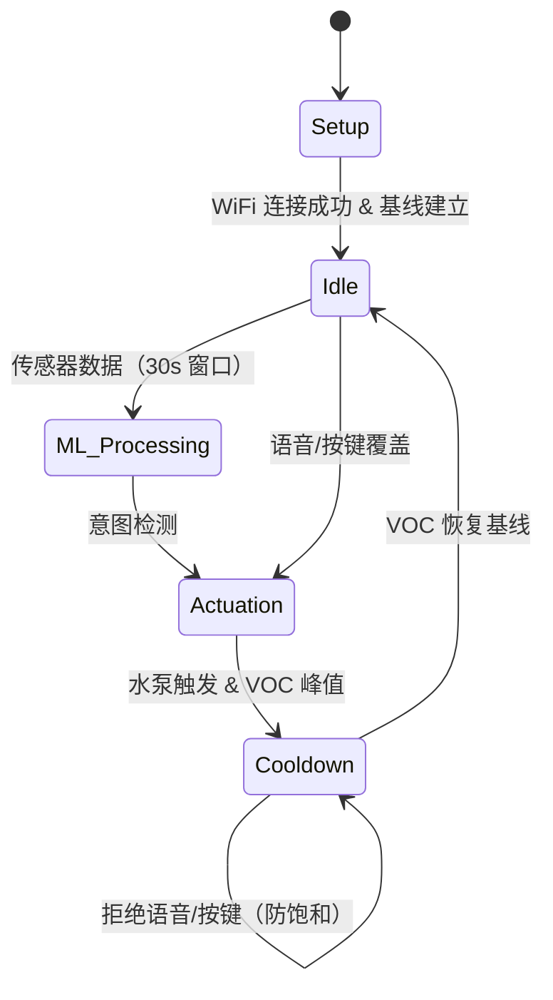

## Executive Summary

第 1 周是项目基础建设周——概念确定、架构定义、硬件下单、开发日志网站上线。

- **概念与架构** — 将 AuraSync 定义为一款基于**化学反馈闭环**的场景感知香氛扩散器：BME680 VOC 传感器检测喷雾后的空气质量，并驱动设备端机器学习的冷却逻辑，防止定时喷雾器常见的过度喷洒问题。
- **硬件选型** — 确定物料清单：XIAO ESP32-S3、BME680、INMP441 I2S 麦克风、超声波雾化器、MT3608 升压模块 + 锂电池。零件已下单，运输中。
- **用户流程** — 完成端到端交互模型文档，绘制功能架构图（见下文）。
- **开发日志网站** — 本网站完成搭建、样式设计并部署至 GitHub Pages。

### 功能架构图

*AuraSync 功能架构图。*

---

## 1. 硬件选型与物料清单

我们对多个组件方案进行了评估，通过权衡利弊，选出最适合原型开发与最终演示的配置方案。

* **微控制器：** 选择 **XIAO ESP32-S3**（双核、原生 I2S 支持、向量指令集），而非 ESP32-C3，以保证有足够的算力余量用于端侧机器学习和音频处理。
* **环境传感器：** 选择 **BME680**，因为其 VOC 传感功能是我们闭环反馈设计的核心（BME280 因不具备此功能被排除）。
* **音频采集：** 采用双路策略——使用低成本 **INMP441** 模块快速原型验证，同时选用 **Adafruit I2S MEMS 麦克风**用于最终可靠演示。
* **执行器与电源：** 选用 **5V 微型水泵**配合 **Adafruit MOSFET 驱动模块**（内置续流二极管），从 3.3V 逻辑板安全驱动感性负载。

**硬件采购物料清单（BOM）：**

| 组件 | 单价 | 数量 | 供应商 | 链接 |
| :--- | :--- | :--- | :--- | :--- |
| Seeed Studio XIAO ESP32-S3 | $7.49 | 2 | Seeed | [产品链接](https://www.seeedstudio.com/XIAO-ESP32S3-p-5627.html) |
| Adafruit BME680 | $18.95 | 1 | Adafruit | [产品链接](https://www.adafruit.com/product/3660) |
| Adafruit I2S MEMS 麦克风 (SPH0645LM4H) | $13.72 | 1 | Amazon | [产品链接](https://a.co/d/067CTL8D) |
| INMP441 I2S 麦克风模块（3 件装） | $9.59 | 1 | Amazon | [产品链接](https://a.co/d/0g3abX0m) |
| 5V 微型潜水泵（4 件装） | $9.43 | 1 | Amazon | [产品链接](https://a.co/d/08kf9tC8) |
| Adafruit MOSFET 驱动模块 | $3.95 | 1 | Adafruit | [产品链接](https://www.adafruit.com/product/5648) |
| MT3608 5V 升压转换器 | $5.95 | 1 | Amazon | [产品链接](https://a.co/d/0g52jXmu) |
| EEMB 3.7V 锂电池 2000mAh | $13.06 | 1 | Amazon | [产品链接](https://a.co/d/0flPrFG1) |

> **方案调整：** 采购过程中，我们意识到标准水泵产生的是水流而非雾气，不适合环境扩散。目前正在研究**超声波雾化器**作为执行子系统的升级方案。

---

## 2. 用户流程

为确保无感、"安静"的用户体验，我们设计了一套防御性、多模态用户流程。系统支持自动机器学习触发、实体按键与语音指令三种触发方式，并通过底层物理冷却锁进行统一保护。

### 阶段一 · 引导配置

* **操作：** 用户填充储液罐、开机，并通过配套应用（如 Blynk）配置 WiFi。
* **状态：** 设备连接云端仪表盘，建立环境基线读数，进入 `Idle`（待机）状态。

### 阶段二 · 端侧推理

* **感知：** BME680 和 I2S 麦克风持续采集环境与声学数据。
* **推理：** ESP32 的端侧机器学习模型对 30 秒滑动窗口数据进行分类，判断使用意图（如*淋浴*或*异味*）。
* **执行与反馈：** 若意图确认，水泵喷雾 2 秒。VOC 传感器检测到香氛峰值后，系统进入 `Cooldown`（冷却）状态，直至空气恢复正常。

### 阶段三 · 语音 / 手动

* **触发：** 用户发出语音指令（"Aura，刷新房间"）或按下实体按键。
* **逻辑判断：**
  * 若系统处于 `Idle` 状态，立即执行喷雾。
  * 若系统处于 `Cooldown` 状态，请求被**拒绝**（LED/音频反馈），防止香氛过量。

### 阶段四 · 云端

* **仪表盘：** 每日同步使用量与空气质量趋势数据至云端。
* **维护提醒：** 系统根据水泵运行时长估算液体消耗量，当液位低于 10% 时推送补液提醒。

### 用户流程图

交互式流程图（HTML + 图标），对应上述四个阶段：引导配置条带、设置/基线建立、待机中枢、并行的机器学习与语音/按键路径、执行动作、带反馈的冷却→待机循环，以及云端遥测。

*状态机参考（Mermaid）：*

---

## 3. 数据与机器学习

我们将环境分类视为**传感器融合 + DSP** 问题。绝对传感器值因各房间基线不同而无意义，因此重点关注时序趋势与多模态上下文信息。

### 传感器数据映射

我们收集什么数据，为什么这样做？

| 传感器 | 数据特征（DSP） | 核心用途 | 重要性 |
| :--- | :--- | :--- | :--- |
| **BME680（气体）** | **VOC 梯度**（$\Delta VOC/\Delta t$） | **"嗅觉"：** 检测卫生间异味，追踪香气衰减。 | **高**（核心触发器 & 冷却锁） |
| **BME680（气候）** | **湿度梯度**（$\Delta H/\Delta t$） | **"皮肤"：** 检测淋浴蒸汽和急剧气流变化。 | **高**（淋浴触发器 & 异常防御） |
| **I2S 麦克风** | **频率能量**（FFT） | **"听觉"：** 区分流水声与吹风机声。 | **中**（误报防御） |

### 核心目标场景

系统如何综合数据理解用户场景：

* **🚽 异味（目标场景）：**
    * *触发：* VOC 急剧上升 + 湿度稳定 + 冲水声。
    * *动作：* 触发执行 $\rightarrow$ 进入冷却。
* **🚿 淋浴（目标场景）：**
    * *触发：* 湿度正斜率急剧上升 + 流水声。
    * *动作：* 触发执行（淋浴后）$\rightarrow$ 进入冷却。
* **💄 梳妆（误报场景）：**
    * *触发：* VOC 突然升高（发胶）+ 吹风机/喷雾声。
    * *动作：* **忽略。** 抑制执行以防香氛过量。
* **🚪 开门气流（异常场景）：**
    * *触发：* 温度/湿度异常急剧下降。
    * *动作：* **暂停机器学习。** 重新校准基线 60 秒。

### 端侧机器学习逻辑

* **趋势优于绝对值：** 计算数据斜率（导数），而非原始数值。
* **30 秒滑动窗口：** 机器学习模型分析 30 秒数据缓冲区，而非瞬时快照。
* **传感器融合：** 将声学特征与环境梯度合并，训练轻量分类器（如通过 Edge Impulse 的随机森林）。
* **置信度输出：** 模型输出概率数组（例如 `[淋浴: 85%, 异味: 10%, 待机: 5%]`），仅在高置信度时触发执行。

---

## 4. 开发日志网站

为维护专业的执行记录，我们使用 **React**、**Vite** 和 **Tailwind CSS** 构建了本静态单页应用。使用 **React Router** 的哈希路由使网站可在 **GitHub Pages** 上正常运行，**Framer Motion** 负责布局与动效。每周内容是带 **YAML front matter**（元数据、分工、图片）的 Markdown 文件；UI 通过 **react-markdown** 配合 **remark-gfm**（表格、任务列表、自动链接等）和 **rehype-slug**（稳定标题锚点）渲染内容——不是自制解析器，而是众多文档网站所依赖的同一生态工具链。这让我们只需写普通 `.md` 文件，同时专注于硬件和机器学习工作。

---

## Next Steps

由于硬件运输延误，下周物理测试暂时受阻。我们将转向并行工程任务：

| 待办 | 任务 | 说明 |
|:-:|---|---|
| <input type="checkbox" checked /> | **原理图与 PCB** | 绘制完整系统原理图，开始初步 PCB 布线。 |
| <input type="checkbox" checked /> | **CAD 建模** | 根据组件尺寸设计可 3D 打印的外壳。 |
| <input type="checkbox" checked /> | **固件框架** | 搭建 ESP32 C++ 代码骨架（传感器循环、WiFi 配置），以便硬件到货后立即烧录。 |
| <input type="checkbox" /> | **机器学习交付物** | 完成数据与机器学习流程演示幻灯片。 |
